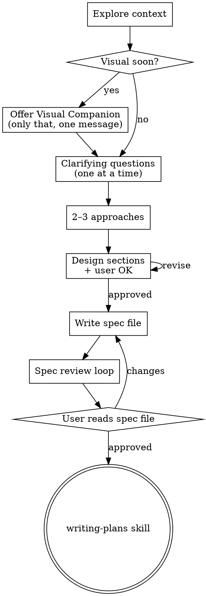

# Brainstorming → Design → Spec (MVP / LuzPerformance)

Turn vague ideas into an **approved written spec** before any implementation. This repo keeps specs under `docs/superpowers/specs/` and plans under `docs/superpowers/plans/`.

<HARD-GATE>
Do **not** write application code, scaffold, or invoke implementation skills until:
1. A design has been presented in sections, and  
2. The user has approved it, and  
3. The spec file exists (and user has had a chance to read it).

“Small change” is not an exception — the design can be a short paragraph, but the gate still applies.
</HARD-GATE>

## Defaults neste repositório

| Artefato | Caminho padrão |
|----------|------------------|
| Design / spec | `docs/superpowers/specs/YYYY-MM-DD-<topic>-design.md` |
| Plano de implementação | `docs/superpowers/plans/YYYY-MM-DD-<topic>.md` (via skill **writing-plans**) |
| Prompt de review de spec | `.agents/skills/brainstorming/spec-document-reviewer-prompt.md` |
| Visual companion (guia) | `.agents/skills/brainstorming/visual-companion.md` |

Se o usuário pedir outro local para o spec, seguir o pedido dele.

## Checklist (ordem fixa)

1. **Contexto do projeto** — ler rotas, layout, tipos em `shared/`, últimas mudanças relevantes.
2. **Visual companion** (opcional, mensagem isolada) — só se mockups/diagramas forem úteis; ver secção *Visual Companion*.
3. **Perguntas** — **uma por mensagem**; preferir múltipla escolha quando couber.
4. **2–3 abordagens** — trade-offs + recomendação.
5. **Design por secções** — aprovação incremental do utilizador.
6. **Escrever spec** — ficheiro em `docs/superpowers/specs/` + commit.
7. **Review do spec** — usar `spec-document-reviewer-prompt.md` com outro contexto (não colar histórico da sessão inteira); corrigir até aprovado **ou** máx. 3 voltas, depois pedir orientação humana.
8. **Utilizador lê o ficheiro** — pedir revisão explícita do `.md` antes de planear implementação.
9. **Seguinte passo** — invocar skill **writing-plans** apenas (não frontend-design, não código direto).

## Information architecture & naming

Quando o trabalho envolve **navegação, menus ou rótulos** (ex.: áreas que parecem sobrepor-se):

- Explicitar **modelo mental** de cada área (pessoas vs recursos vs finanças).
- Evitar **colisão de termos** (ex.: “Ativos” no CRM ≠ “pacientes ativos” na gestão).
- No spec: tabela *Área | Rota | Utilizador-alvo | Entidade principal | Rótulo recomendado*.

Isto reduz retrabalho de UI mais do que polish visual prematuro.

## Process flow

**Estado terminal:** invocar **writing-plans**. Não invocar frontend-design nem outras skills de implementação a partir deste skill.

## Understanding the idea

- Avaliar **âmbito**: se forem vários subsistemas independentes, decompor primeiro e brainstormar o primeiro pedaço.
- Objetivo: propósito, restrições, critérios de sucesso.
- Em codebases existentes: seguir padrões atuais; refatorações só se servirem o objetivo actual.

## Presenting the design

- Secções curtas ou longas conforme complexidade.
- Cobrir quando relevante: arquitetura, componentes, fluxo de dados, erros, testes, **nomenclatura/IA**.
- Perguntar “faz sentido até aqui?” após cada bloco maior.

## After the design

**Ficheiro de spec** — markdown claro: contexto, decisões, fora de âmbito, critérios de aceitação.

**Mensagem tipo após commit:**

> Spec em `docs/superpowers/specs/…`. Revê o ficheiro e diz se queres alterações antes do plano de implementação.

**Implementação** — só depois: **writing-plans**. Nenhuma outra skill de implementação neste passo.

## Key principles

- Uma pergunta por mensagem.
- Múltipla escolha quando ajudar.
- YAGNI nos desenhos.
- Sempre 2–3 abordagens antes de fechar.
- Validação incremental com o utilizador.

## Visual Companion

Ferramenta opcional para mockups/diagramas. **Oferta numa mensagem só**, sem outras perguntas misturadas — texto sugerido no skill original (consentimento + aviso de tokens).

Se aceitarem, ler `.agents/skills/brainstorming/visual-companion.md` antes de usar.

**Regra por pergunta:** usar browser só quando **ver** for claramente melhor que ler (layouts, comparações visuais). Perguntas conceptuais ficam em texto.
